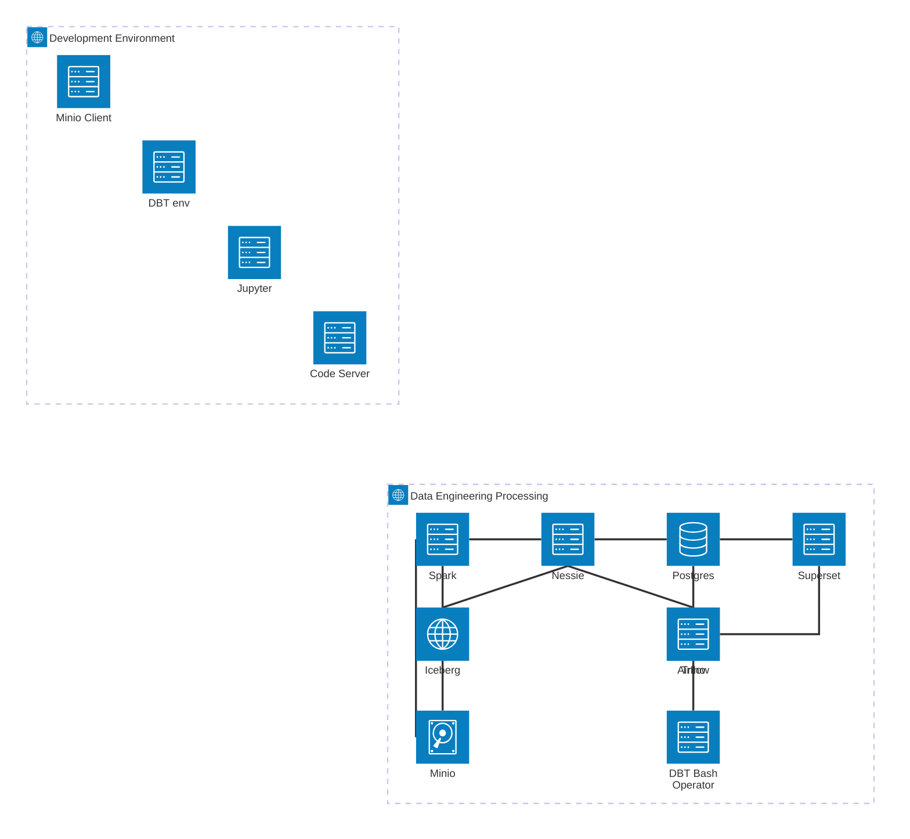

- [Overview](#overview)
- [Building](#building)
- [Endpoints](#endpoints)
- [Usage](#usage)
- [Resetting the environment](#resetting-the-environment)
- [DBT development](#dbt-development)
- [Further Reading](#further-reading)
- [Next Steps](#next-steps)


# Overview
A all-in-one development environment to test out / prototype data engineering pipelines. You should be able to simply checkout the project and bring it up to begin hacking. 



# Building
Bringing up the stack is super simple. Basically checkout the project and build / up the environment as follows:

```sh
> git checkout git@github.com:dretay/dataengineering-example.git
> cd dataengineering-example
> docker-compose build
> docker-compose up
```

# Endpoints
| Service  |  Credentials | Description |
|-------|-------------|----------|
| [Minio](http://datastack.internal:9001/login)                  | admin / password | S3 Object store               |
| [Airflow](http://datastack.internal:8081/)                     | admin / admin    | DAG and workflow              |
| [Jupyter](http://datastack.internal:8888/lab)                  | N/A              | Python execution environment  |
| [Nessie](http://datastack.internal:8080/ui/login.html)         | N/A              | Data catalog                  |
| [Spark](http://datastack.internal:8088/login/)                 | N/A              | Data processing engine        |
| [Superset](http://datastack.internal:8082/ui/login.html)       | admin / admin123 | Data visualization            |
| [Trino](http://datastack.internal:8081/)                       | admin            | Distributed SQL engine        |
| [Codeserver](https://datastack.internal:7443/)                 | N/A              | VSCode                        |


# Usage
1. The stack comes with a built-in code editor (codeserver) which is basically VSCode served up in a browser. VSCode has some CORS requirements that require that it be served from a HTTPS endpoint. For that reason the stack includes a NGINX server with a self-signed cert for `datastack.internal`. Before using the editor you will need to modify your hosts file and add an entry for `127.0.0.1 datastack.internal`.
2. You need to load some initial data before beginning ingestion. Launch the [download_sales](http://datastack.internal:8888/lab/tree/download_sales.ipynb) notebook to upload a demo parquet file into your datalake
3. To ingest the data you need to define a trino connector in airflow before running the DAG. 
   1. Login to Airflow
   2. Go to `Admin` -> `Connections`
   3. Click `+` to add a new connection and fill it out as follows:
      1. `Connection Id`: trino_conn
      2. `Connection Type`: Trino
      3. `Host`: trino
      4. `Login`: admin
      5. `Port`: 8080
4. Once the connection is correctly defined, you should be able to run the `datalake_etl_pipeline` DAG
   1. If you run into an error, you can view the stacktrace by clicking on `Graph` then clicking on the node that is failing, and finally clicking on `Logs`.
   2. **ProTip**: If there is no obvious cause of the error (like a missing file) it may be caused by Docker being allocated enough RAM. Consider a "free" example of testing recovery from an incomplete ingest.
5. You can verify that the data was properly ingested / transformed by checking the database. In Codeserver, install the `Database Client` plugin. You can then use the plugin to create a connection to the local trino instance with the following information:
   1. `URL`: trino:8080
   2. `Username`: admin
6. Once in the database you should see the original `raw` sales table as well as the modified `sales` sales table.

# Resetting the environment
To fully reset the environment just delete the postgres data (so the catalog will be re-created) and nuke all your containers:
```sh
> /bin/rm -rf postgres/postgres_data
> docker rm -vf $(docker ps -aq)
```

# DBT development
To keep the environment fully portable, the demo is shipped with a stabd-alone DBT container. To launch it you can simply shell into the dbt container from the top-level folder: 
```sh 
> docker exec -ti dbt /bin/bash
```

Here are the notes on how I created the example DBT environment:
1. dbt init
2. cd datalake
3. add the following to dbt_project.yml:
```
    models:
    datalake:
        staging:
        +materialized: table
        +schema: staging
        marts:
        +materialized: table
        +schema: sales
```
4. add `workspace/datalake/macros/generate_schema_name.sql` macro

# Further Reading
1. [Trino + dbt Transformations In SQL Heaven](https://www.youtube.com/watch?v=UYS75sjTziU) a super helpful guide to why DBT is so powerful and how it can be applied to an ingestion pipeline.
2. [Apache Iceberg™ | What It Is and Why Everyone’s Talking About It](https://www.youtube.com/watch?v=TsmhRZElPvM) a good into into iceberg as a data catalog and how it compares to traditional SQL
3. [Trino for Large Scale ETL at Lyft](https://www.youtube.com/watch?v=FL3c1Ue7YWM) a really good discussino on how Lyft uses Spark and Trino in conjunction with each other to do data analytics.
4. [A MinIO whitepaper](https://blog.min.io/the-case-for-on-prem-iceberg-cost-control-and-performance/) about some of the cost considerations of doing on-prem dataengineering vs doing it in the cloud. 

# Next Steps
1. Integrate with Kafka with a [sink](https://iceberg.apache.org/docs/nightly/kafka-connect/) to show streaming ingestion
2. Integrate DuckDB and show Trino federating between the Spark and DuckDB (faster vs larger). Maybe show this with the iceberg-rest stuff?
3. Flush out ETL example with a more complex data set and show Superset actually integrated.